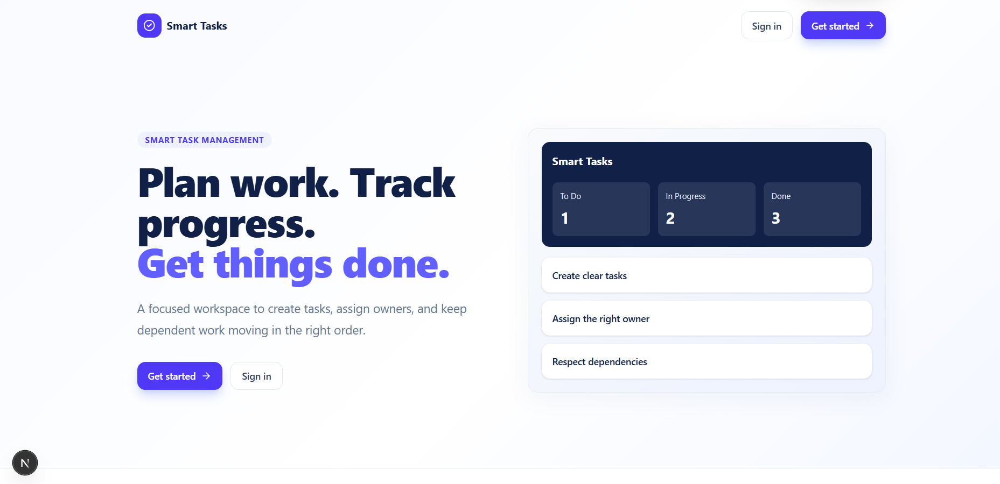
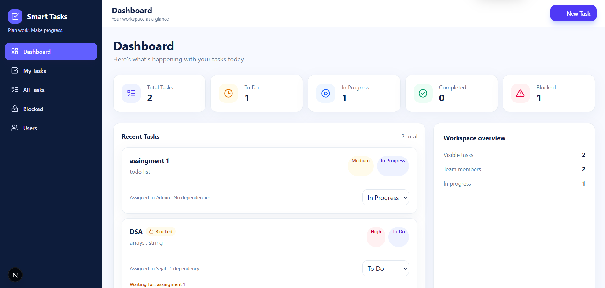
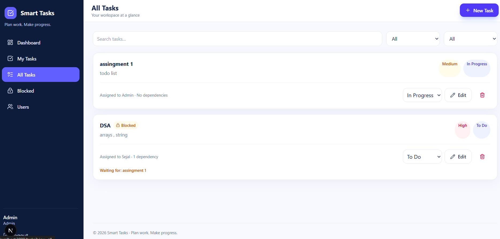
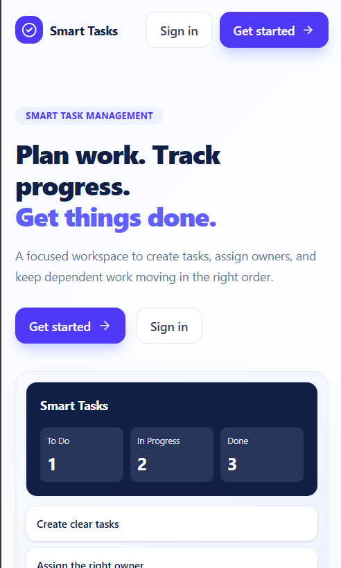

# Smart Task Manager

## 1. Project overview

A full-stack task management application built as a Front End Intern assignment. It implements role-based task assignment with dependency-aware status transitions, mock JWT authentication, and an admin/user dashboard experience. It gives a team a single workspace to create work, assign an owner, track progress, and prevent work from being completed before its prerequisites are ready.

The project deliberately contains two runnable parts:

1. A **Next.js frontend** that is currently local-first. It stores its users, session, tasks, timestamps, and task-history entries in the browser's `localStorage`.
2. An **Express API** that demonstrates the requested in-memory backend API. Its users, tasks, and sessions live in server-side `Map` objects and are reset when the server restarts.

> [Live URL](https://smart-task-manager-gamma-vert.vercel.app/)

## 2. Problem solved

Teams need to know what work exists, who owns it, what state it is in, and whether it is safe to complete. A plain checklist does not express dependencies. This application addresses that gap by making task owners, priorities, statuses, and prerequisite tasks visible. A task with an unfinished dependency is shown as blocked and cannot be moved to `Done`.

## 3. Implemented features

| Area | Implemented behavior |
| --- | --- |
| Authentication | Sign in and sign out with a browser-stored session in the frontend; login and logout endpoints in the backend. |
| User management | An administrator can create regular user accounts and view the users page. Public signup is not exposed in the UI or backend. |
| Task CRUD | Administrators create, edit, and delete tasks. Deletion is rejected if another task depends on the target task. |
| Task details | Title, description, priority, status, assignee, dependency IDs, created/updated timestamps, and local task history are recorded. |
| Priorities | `Low`, `Medium`, and `High`. |
| Statuses | `To Do`, `In Progress`, and `Done`. |
| Assignment | An administrator can assign a task to an existing user or leave it unassigned. |
| Dependencies | Self-dependencies, missing dependency IDs, duplicates, and circular dependency chains are rejected. |
| Completion rule | A task cannot be marked `Done` while any dependency is not `Done`. |
| Views | Dashboard, My Tasks, All Tasks, Blocked Tasks, and Users. |
| Filters | Task title search plus status and priority filters. |
| Feedback | Loading, empty, validation, and action-error states are rendered in the UI. |
| Responsive UI | Mobile drawer navigation, tablet-friendly grids, desktop sidebar, responsive forms, and a modal that becomes bottom-aligned on small screens. |

### Roles

| Capability | Administrator | Regular user |
| --- | ---: | ---: |
| View dashboard | Yes | Yes, assigned work only |
| View My Tasks | Yes | Yes |
| View All Tasks / Blocked Tasks | Yes | No navigation link |
| Create users | Yes | No |
| Create, edit, delete tasks | Yes | No |
| Change task status | Yes | Only an assigned task |

## 4. Dependency and completion rules

1. A dependency must refer to an existing task.
2. A task cannot depend on itself.
3. A dependency graph cannot contain a cycle.
4. A blocked task is any non-completed task with at least one unfinished dependency.
5. `Done` is disabled in the task UI for a blocked task and the frontend storage service and Express API enforce the same rule.
6. A task cannot be deleted while another task lists it as a dependency.

## 5. Architecture and data flow

### Current frontend data flow

```text
Browser
  │
  ▼
Next.js pages and reusable components
  │  calls async-shaped methods
  ▼
frontend/lib/api.ts (UI data facade)
  │
  ▼
frontend/lib/storage.ts (rules, permissions, history, persistence)
  │
  ▼
window.localStorage
  ├── users
  ├── tasks
  └── current session
```

### Separate backend API flow

```text
HTTP client
  │ Authorization: Bearer <session token>
  ▼
Express server → CORS + JSON middleware → routes.ts
                                             │
                           Zod validation + auth/role checks
                                             │
                                             ▼
                                      store.ts Map objects
                              users / tasks / sessions (memory only)
```

### Decision record

| Decision | What and why | Main trade-off |
| --- | --- | --- |
| Local-first UI repository | `storage.ts` keeps persistence and business rules outside React components, making the UI usable without a backend and easier to migrate later. | Data is per browser and not shared across devices. |
| Async API facade | `api.ts` returns promises although it currently calls local storage synchronously, preserving a backend-ready UI contract. | The name `api` can be mistaken for live HTTP communication. |
| Express in-memory API | `Map` objects meet the no-database exercise requirement and make ID lookup straightforward. | All API data disappears on restart. |
| Zod input schemas | Routes reject malformed request bodies consistently. | Schemas must be maintained when fields change. |
| Client-side responsive Tailwind utilities | Breakpoints live beside each component, keeping small layouts close to their UI. | Markup class strings are longer. |

## 6. Technology stack

| Technology | Used for | Why it is used |
| --- | --- | --- |
| Next.js 16 + React 19 | Frontend application and routes | Component-based UI with App Router pages and production build tooling. |
| TypeScript | Frontend and backend | Makes role, status, task, and API shapes explicit. |
| Tailwind CSS 4 | UI styling | Responsive utility classes and reusable style primitives. |
| Lucide React | Icons | Lightweight, consistent UI icons. |
| Node.js + Express 5 | Backend API | Small HTTP server with route middleware. |
| Zod | Backend validation | Validates login, user, task, and status payloads. |
| CORS + dotenv | Server configuration | Restricts browser origin and reads local environment configuration. |
| TSX | Backend development runner | Runs TypeScript directly and supports watch mode. |

## 7. Project structure

```text
smart-task-manager/
├── frontend/
│   ├── app/                    # Next.js pages, layout, and global CSS
│   │   ├── dashboard/
│   │   ├── login/
│   │   ├── tasks/
│   │   └── users/
│   ├── components/             # Sidebar, task card/form, modal, footer
│   ├── lib/                    # local storage repository and UI data facade
│   ├── public/                 # Static Next.js assets
│   ├── types.ts                # Frontend domain types
│   └── package.json
├── backend/
│   ├── src/
│   │   ├── server.ts           # Express bootstrap and middleware
│   │   ├── routes.ts           # API endpoints, validation, authorization
│   │   ├── store.ts            # In-memory Maps and dependency helpers
│   │   └── types.ts            # Backend domain types
│   ├── .env                    # Local server configuration (not documented as secrets)
│   └── package.json
└── docs/
    ├── frontend-documentation.md
    └── backend-api-documentation.md
```

## 8. Authentication, authorization, and persistence

The frontend seeds a single administrator in browser storage only when its user collection does not exist. Its login service compares the entered credentials against that local collection and stores a session object separately. Administrators create regular users in the Users page. Password values are excluded from user objects returned to frontend components, but they are not hashed; this is an assignment-level mock-auth design and must not be used for production.

Frontend `localStorage` persists until browser site data is cleared. It stores user records, task records, session data, and a task history array. The Express API has independent in-memory data and resets on restart. There is no database, MongoDB, Firebase, Supabase, or external persistence service.

## 9. API overview

The server mounts the same router at both `/api` and `/api/v1`. Every endpoint below is available under either prefix. The detailed request/response reference is in [docs/backend-api-documentation.md](docs/backend-api-documentation.md).

| Group | Endpoints |
| --- | --- |
| Authentication | `POST /auth/login`, `POST /auth/logout` |
| Users | `POST /auth/users`, `GET /users` |
| Workspace | `GET /dashboard` |
| Tasks | `GET /tasks`, `GET /tasks/blocked`, `GET /tasks/:id`, `POST /tasks`, `PUT /tasks/:id`, `PATCH /tasks/:id/status`, `DELETE /tasks/:id` |

## 10. Installation and run commands

### Prerequisites

- Node.js 20.9 or later is required by the installed Next.js version.
- npm is used because both applications include `package-lock.json`.

### Frontend

```bash
cd frontend
npm install
npm run dev
```

Open `http://localhost:3000`.

Useful frontend commands:

```bash
npm run lint
npm run typecheck
npm run build
npm run start
```

### Backend

```bash
cd backend
npm install
npm run dev
```

The default server port is `5000`. For a production-style run, compile first and then start the generated JavaScript:

```bash
npm run build
npm run start
```

Check backend types with:

```bash
npm run typecheck
```

### Environment variables

The backend reads these optional variables from `backend/.env`:

| Variable | Purpose | Default |
| --- | --- | --- |
| `PORT` | Express listening port | `5000` |
| `FRONTEND_URL` | CORS-allowed frontend origin | `http://localhost:3000` |

Do not commit production secrets. The current project does not define a JWT secret, database URL, or third-party API key.

## 11. Testing and verification

The repository currently provides static checks rather than an automated test suite. Run:

```bash
cd frontend
npm run lint
npm run typecheck
npm run build

cd ../backend
npm run build
npm run typecheck
```

Manual checks should cover signing in, administrator user creation, task CRUD, filters, assignment, dependency rejection, blocked-task completion rejection, responsive navigation, and sign out.

## 12. Responsive UI

The UI uses a mobile-first layout. It has a 320px minimum document width, smaller mobile text and spacing, a drawer navigation on screens below the large breakpoint, multi-column grids on tablets, and a fixed desktop sidebar from the large breakpoint onward. The task form changes from one column to two columns at the small breakpoint; the modal is bottom-aligned on mobile and centered from the small breakpoint.

## 13. Deployment

No deployment configuration, hosting configuration, CI workflow, Dockerfile, or production environment configuration is present in this repository. Deployment is therefore not documented as implemented.

## 14. Known limitations

- The frontend and Express API do not currently communicate with each other.
- Browser data is limited to one browser/origin and is visible to that browser user.
- Passwords are stored without hashing in both implementations.
- Sessions are random IDs without expiry, refresh, or secure cookie handling.
- The backend has no database and loses all data after restart.
- The backend task type does not include the frontend-only task history field.
- There are no automated unit, integration, or end-to-end tests.

## 15. Future improvements

1. Replace the frontend storage facade internals with authenticated HTTP calls to the Express API.
2. Add a durable database and migrations.
3. Hash passwords and use secure, expiring session or token handling.
4. Add automated tests for dependency cycles, permissions, and UI workflows.
5. Add pagination, task due dates, activity-history UI, accessibility focus trapping, and user/task editing features where needed.
6. Add deployment, environment templates, health checks, logging, and CI.

## 16. Troubleshooting

| Issue | Likely cause and fix |
| --- | --- |
| `npm` is blocked by a PowerShell execution-policy error | Run `npm.cmd` instead of `npm`, or use a shell configuration that permits the npm PowerShell shim. |
| Port is already in use | Stop the process using port `3000` or `5000`, or set a different backend `PORT`. |
| Backend requests fail because of CORS | Ensure `FRONTEND_URL` exactly matches the frontend origin and restart the backend. |
| Local users/tasks look stale | Clear the site data/local storage for the frontend origin; this resets local-first data. |
| Backend users/tasks disappeared | This is expected after restarting the Express process because its store is in memory. |
| A task cannot be completed or deleted | Inspect its dependencies: unfinished prerequisites block completion, and dependent tasks block deletion. |

## 17. Screenshots

| Landing Page | Dashboard |
|---|---|
|  |  |

| Task Management | Mobile Navigation |
|---|---|
|  |  |

## 18. Author

**Sejal Kamble**  
B.Tech, Computer Science and Engineering | Full-Stack & AI Developer
